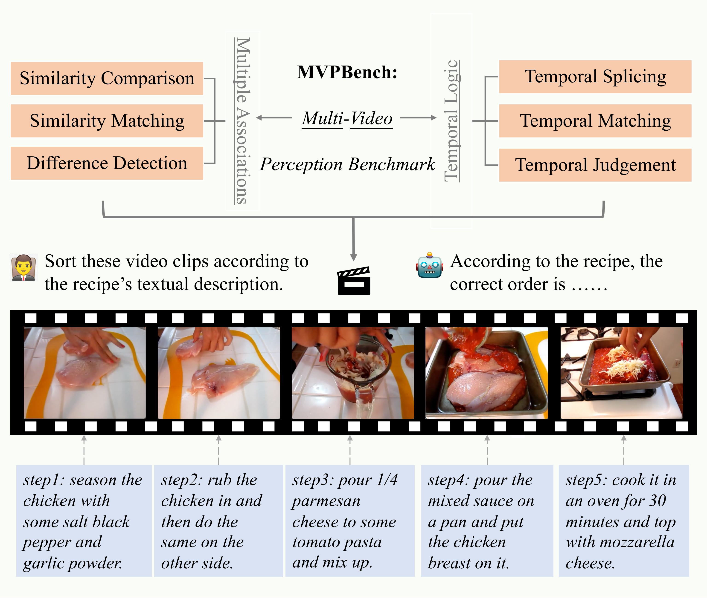
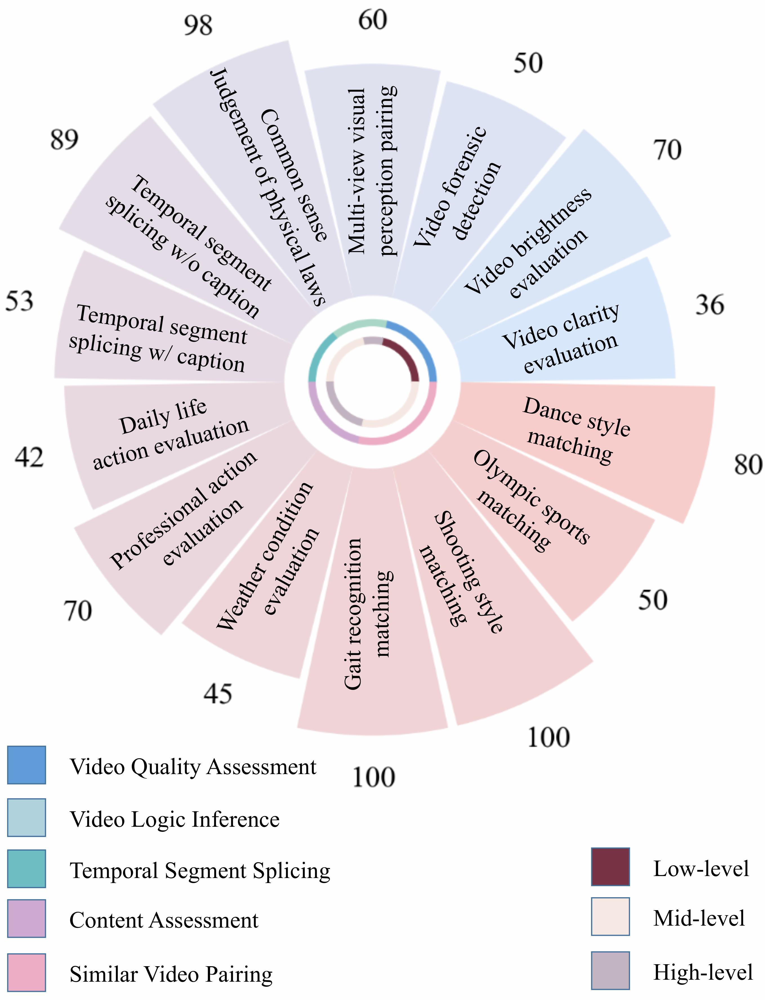

# MVPBENCH

This repo contains code evaluation and dataset for the paper MVPBench: A Multi-Video Perception Evaluation Benchmark for Multi-modal Video Understanding

## Introduction
The rapid progress of Large Language Models (LLMs) has spurred growing interest in Multi-modal LLMs (MLLMs) and motivated the development of benchmarks to evaluate their perceptual and comprehension abilities. Existing benchmarks, however, are limited to static images or single videos, overlooking the complex interactions across multiple videos. To address this gap, we introduce the **M**ulti-**V**ideo **P**erception Evaluation **Bench**mark (**MVPBench**), a new benchmark featuring **14** subtasks across diverse visual domains that task models with extracting relevant information from video sequences to make informed decisions. MVPBench includes **1K** question-answering tests involving **2.7K** video clips sourced from existing datasets and manually annotated clips. Extensive evaluations reveal that current models struggle to process multi-video inputs effectively, underscoring substantial limitations in their multi-video comprehension. We anticipate MVPBench will drive advancements in multi-video perception.

## Dataset
MVPBench includes a diverse set of 14 subtasks that evaluate the model’s capabilities across various dimensions. These tasks range from basic to advanced levels, covering a variety of question-answering formats from low-level pattern recognition to high-level semantic interpretation, thereby imposing rigorous demands on model performance across perceptual and cognitive dimensions. During the design process, these tasks adhere to the design principles which emphasize the consideration of both the multiplicity of evaluation inputs and the temporal aspects of evaluation videos. This approach ensures that the tasks are structured to effectively assess models on their ability to manage diverse input types and to accurately interpret and utilize the timing and sequence of video data. 

All data is hosted on [google pan](https://drive.google.com/drive/folders/1geVRGz6SFT8726R0tpljdwf3kJxvFFza?usp=sharing) and is divided according to different task names and stored in zip compression format.

Statistics of MVPBench are shown below. The benchmark includes 14 tasks in 5 domains, ranging from low-level pattern comparison to mid-level temporal logic reasoning, and extending to high-level visual content understanding.

## Evaluation
We adhere to the default inference settings of the [SWIFT](https://github.com/modelscope/ms-swift/tree/main) framework, utilizing the <video> placeholder to predefine the position of the input video within the prompt. This approach facilitates the integration of visual and language input, guiding the model accordingly. We employ a set of predefined rules along with GPT-3.5-turbo to extract the selected answer from the model’s output.

## Disclaimers
For some specific tasks in MVPBench, we manually collected images that are publicly available from online search. We have made every effort to ensure that the images included in this paper are used in accordance with applicable copyright laws and are properly credited. However, if you are the copyright owner of any image included in our work and believe that its use conflicts with your licensing agreements, please contact us directly. We are committed to addressing any legitimate concerns promptly.

